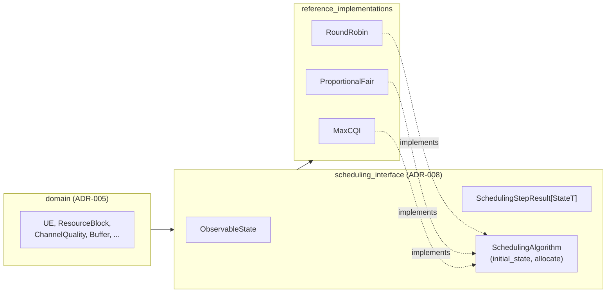
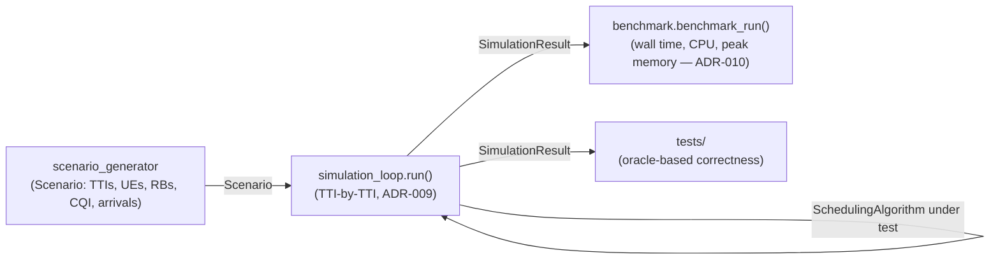
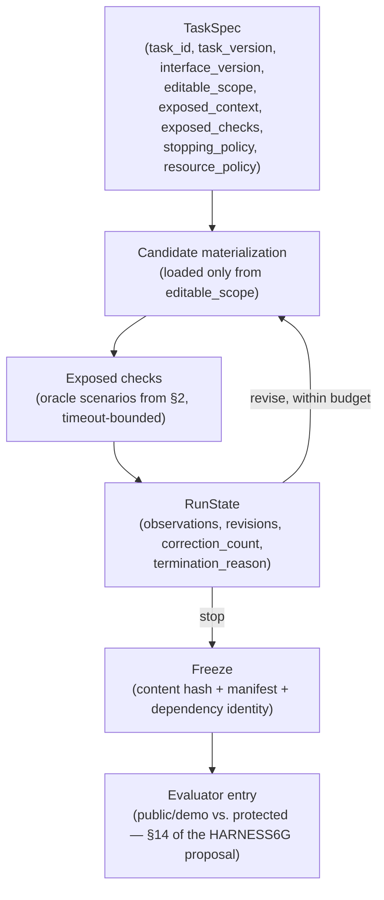

# Design document: component, experimental environment, and HARNESS6G

This document exists to keep three architectures that this project deliberately treats as separate — visibly separate, in one place. It responds directly to two pieces of advising feedback from the 2026-09-11 meeting: the primary advisor's car/road distinction (the architecture of the thing built is not the architecture of the environment that tests it), and the co-advisor's observation that prior documents mixed components, general architecture, functionality, and implementation together.

None of the three sections below duplicates its own module's detail. Each links to the ADR, specification, or module `README.md` that already owns that detail; this document's job is only to say what exists, where its boundary is, and how the three relate.

| Car/road example | Corresponds to | Detail lives in |
|---|---|---|
| The car, its parts, and how they connect | The scheduling component: contract, entities, reference implementations | [§1](#1-architecture-of-the-scheduling-component-the-car) |
| The road, asphalt, or treadmill | The experimental environment: scenarios, closed-loop execution, checks, measurement | [§2](#2-architecture-of-the-experimental-environment-the-road) |
| — (a third role, not in the car/road example) | HARNESS6G: how a candidate component is produced, checked, and frozen before the environment ever runs it | [§3](#3-architecture-of-harness6g) |

## 1. Architecture of the scheduling component (the car)

A scheduling component is one implementation of `radio_scheduler.scheduling_interface.SchedulingAlgorithm`: a pair of pure functions, `initial_state() -> StateT` and `allocate(observable_state, scheduler_state) -> SchedulingStepResult[StateT]`, with all state explicit and threaded by the caller — never hidden inside the object (ADR-008). It never observes anything beyond `ObservableState`: the current TTI, eligible UEs, available Resource Blocks, Channel Quality, and Buffer/HARQ state (ADR-002's exogenous/decision-dependent split, `scheduling_interface`'s own contract).

Three reference implementations exist today (`RoundRobin`, `ProportionalFair`, `MaxCQI`), documented in [`src/radio_scheduler/reference_implementations/README.md`](../src/radio_scheduler/reference_implementations/README.md). "How each part of the car works" — the internal policy of a given algorithm — is functional specification and implementation-documentation territory, not this document's: see each algorithm's own docstrings/tests and `docs/specification/domain-model-v0.1.md` for the entities it reads.

A candidate produced by HARNESS6G (§3) or by a baseline (Delivery C) is, structurally, one more implementation of this same contract — HARNESS6G does not define a looser or different contract for candidates (ADR-011).

## 2. Architecture of the experimental environment (the road)

The environment is everything that puts a scheduling component under test and measures what happened, without ever being the thing tested itself: `scenario_generator` (produces the exogenous state a scenario consists of), `simulation_loop` (drives one `SchedulingAlgorithm` through a `Scenario` TTI by TTI, ADR-009), `benchmark` (measures computational cost of that run, ADR-010), and `tests` (asserts decisions against known-correct expected output for fixed scenarios — correctness, not cost).

"How to check whether the car runs under these conditions" — oracles, invariants, acceptance criteria — is the evaluation methodology this environment exists to support; concretely, that means: functional tests with an expected-decisions oracle (§4, Delivery A), the four HARNESS6G acceptance categories (build validity, interface conformance, functional correctness, domain conformance — `docs/proposal-traceability.md`), and the computational-cost benchmark (already implemented, ADR-010). Radio-performance metrics (throughput, fairness, packet latency/QoS) remain out of scope until a CQI-to-rate/capacity model exists (ADR-006, ADR-009) — this document does not change that.

## 3. Architecture of HARNESS6G

HARNESS6G is neither the car nor the road: it is what decides which car is even allowed onto the road, and under what conditions. Concretely, it is the machinery that takes a task specification, materializes a candidate component inside a restricted scope, runs exposed checks against it (using the environment from §2, without ever exposing the protected evaluator), records structured observations and revisions, and — on termination — freezes a terminal candidate and hands it to a separate evaluator. It lives at `src/radio_scheduler/harness6g/`, a subpackage with a one-way dependency on §1/§2's modules (ADR-011); none of those modules may import it back.

The five HARNESS6G harness responsibilities (context, state, tools, feedback, termination) are functional commitments this flow must satisfy, not five mandatory separate modules (per the HARNESS6G proposal's own §10 note) — this project's mapping is one small, coherent module tree, listed with its exact HARNESS6G requirement and evidence in [`docs/proposal-traceability.md`](proposal-traceability.md).

HARNESS6G v0.1, as delivered here, runs in **demo/replay mode**: no specialized model (e.g. OTel 2.0) is qualified or connected yet (`docs/proposal-traceability.md` marks that row explicitly pending). Candidates are imported from fixtures or produced by a real, bounded invocation of a general-purpose coding agent (Delivery C's baseline path) — never presented as output of a qualified specialized model. See [`docs/demo.md`](demo.md) for exactly which runs are live invocation vs. import/replay.

## 4. ADR classification

Existing ADRs, classified by which of the three architectures above they primarily govern. Several cross more than one boundary; those are marked **transversal** and explained rather than force-fit into one bucket. No ADR is renumbered, duplicated, or rewritten by this classification.

| ADR | Primary subject | Why |
|---|---|---|
| ADR-001 (JSON scenario format) | Environment | Governs how `Scenario` data is represented/serialized — an environment concern, not the component's contract. |
| ADR-002 (closed-loop simulation) | Environment | Defines the exogenous/decision-dependent state split the environment (`simulation_loop`) implements. |
| ADR-003 (scheduling pipeline delay `d`) | **Transversal** | `d` is a parameter of the environment's driver (`simulation_loop.run`), but it changes what the component's contract lets an algorithm observe — it constrains both sides of the seam. |
| ADR-004 (language/tooling) | **Transversal** | Applies to the whole project, including HARNESS6G (ADR-011 explicitly preserves it). |
| ADR-005 (`domain` module) | **Transversal** | `domain` is the shared entity vocabulary the component, the environment, and HARNESS6G candidates all depend on identically. |
| ADR-006 (entity representation conventions) | **Transversal** | Same reason as ADR-005 — e.g., the CQI-as-index convention constrains both reference implementations and any HARNESS6G candidate. |
| ADR-007 (scenario generator reproducibility) | Environment | Scoped entirely to `scenario_generator`'s own seeding/determinism contract. |
| ADR-008 (scheduler statefulness) | Component | Defines the exact contract every scheduling component — reference or candidate — implements. |
| ADR-009 (simulation loop v0.1) | Environment | Module ownership and semantics of the environment's TTI-by-TTI driver. |
| ADR-010 (computational-cost benchmark v0.1) | Environment | Evaluation-methodology decision: what the environment measures and what it deliberately does not (yet). |
| ADR-011 (HARNESS6G namespace and boundary) | HARNESS6G | This document's own companion decision — where HARNESS6G's code lives and which way its dependencies point. |

## 5. Where the rest of the detail lives

- **Functional specification** (behavior, inputs, outputs, state, errors, properties): `docs/specification/domain-model-v0.1.md`, `docs/specification/benchmark-v0.1.md`, and each module's own docstrings/tests.
- **Implementation documentation** (files, classes, functions): each module's `README.md` under `src/radio_scheduler/*/`.
- **Evaluation protocol** (criteria, scenarios, oracles, measurement): `docs/proposal-traceability.md` (HARNESS6G requirements → mechanism → evidence) and Delivery A's demo scenarios/oracles.
- **Checkpoint** (what is done, how it was verified, where to resume): `docs/CHECKPOINT.md`.
- **Development method** (how Claude Code was used to build this project, as distinct from HARNESS6G's own candidate-generating model): `docs/ai-development-method.md`.
